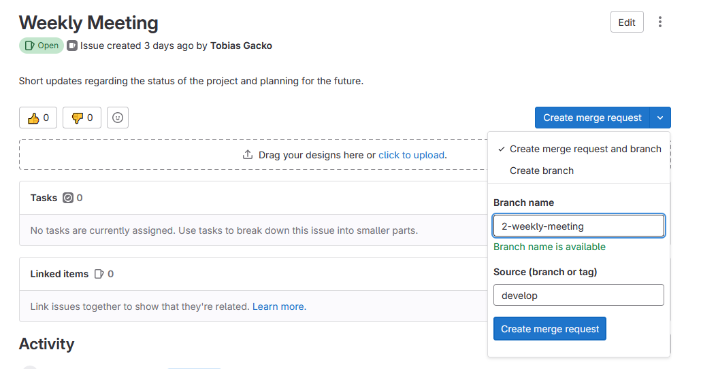

<h1 align="center">Development Guidelines 📖</h1>

## Language

The commentaries, commits and other forms of documentation related to the project are to be typed in English.

## Code conventions

The code conventions used are those of the respective programming language, as we will be implementing this project with
Django, we follow the guidelines specified in [PEP 8 – Style Guide for Python Code](https://peps.python.org/pep-0008/).

## Commit conventions

Create Branches with the same name as made by GitLab under "Issues" in square brackets, followed by a short summary.
In the next two lines, elaborate what was implemented.

```
[issue-<issue_nr>] short summary

what was implemented
```

### Example

As shown in picture below, the branch name is "2-weekly-meeting". A commit message would look in the following manner:

```
[2-weekly-meeting] Example for a commit.

Providing the users with a detailed description of how a commit should be formulated.
```



## Time-tracking

After each meeting or any work related to the project, the team member is expected to push the time invested into the
project to the respective issue.
* Time is preferably documented in 15 minute intervals.