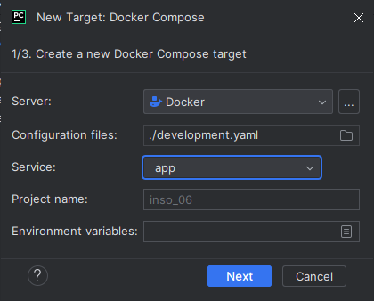
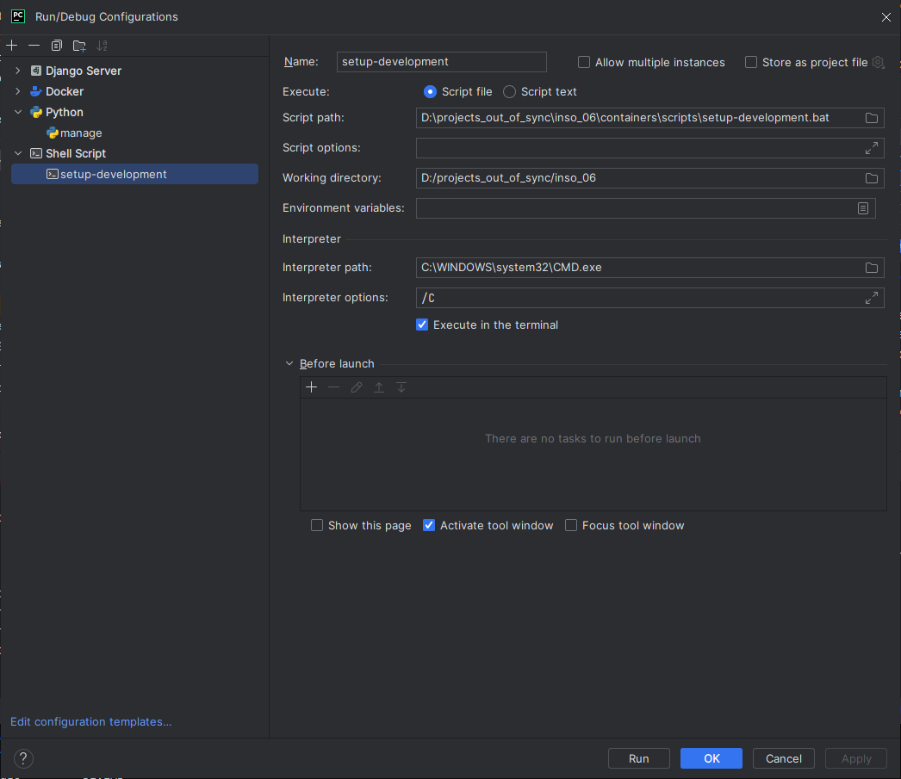

# Common-environment development setup
Please find a quick tutorial on how to set the recommended tools to develop the app as efficiently as possible :D

This way the developers use the common development environment (which is the same as the production one) from the development.yaml docker-compose file.

## Prerequisites
The following tools are required:
- docker.

The following tools are *recommended*:
- JetBrains PyCharm.

## Workflow
1. Rebuild the 'development' image from development.Dockerfile; 
2. Enable 'mariadb' and 'phpmyadmin' services from the development.yaml docker-compose file;
3. Run the 'app' service with a command as many times as possible to run the app.

## IDE-Automated development
How to integrate the workflow into the PyCharm IDE.
1. Open the project in PyCharm
2. Add a new python interpreter:
   1. Settings -> Project -> inso_06 -> Add Interpreter
   2. Select 'on Docker Compose'
   3. Fill in the fields as indicated below:
      1. Server -> your docker server (usually filled in automatically)
      2. Configuration files -> development.yaml
      3. Service -> app
      4. Project name -> default
      5. Environment variables -> empty
      
   4. Click 'next' two times (don't change anything else)
3. Add a new configuration to run a docker script (from containers/scripts). This will make sure that the steps 1. and 2. of the workflow are also being run automatically:
   1. In the upper-right corner next to the 'play' and 'debug' buttons hit the settings icon and click 'Edit';
   2. Add a new shell script:
      1. script path -> path to the script from the containers/script directory (choose bat/sh depending on your OS);
      2. (don't skip that) interpreter path -> windows: C:\WINDOWS\system32\CMD.exe, linux: /bin/bash
      3. (don't skip that) interpreter options -> windows: /C, linux: -c
      
4. Edit your default python configuration to use the new interpreter and execute the new configuration as a before step:
   1. make sure that the interpreter you created is selected
   2. add those parameters: runserver 0.0.0.0:8000
   3. click on 'Modify options' and add a before launch task
   4. select 'Run another configuration' and select the configuration with the shell script you created

## Manual development
Steps 1. and 2. of the workflow:
```shell
docker-compose -f development.yaml --profile manual build
docker-compose -f development.yaml --profile manual up -d
```

Run the app:
````shell
docker exec -it app python3 /var/inso_06/manage.py runserver 0.0.0.0:8000
````

## Warning
After each change to the `requirements.txt` file the `development` image has to be **deleted** and then rebuild. So after every pull from git, it is recommended to do:
````shell
docker stop app
docker remove app
docker rmi development
````