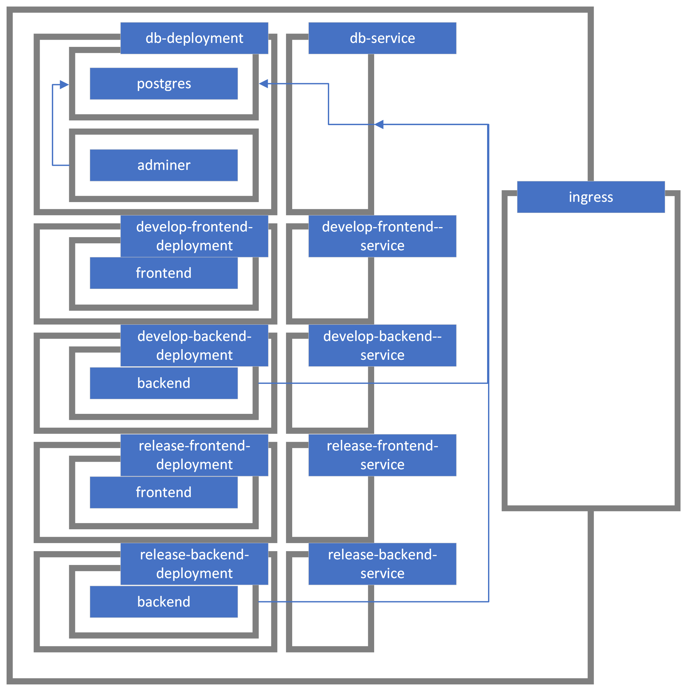
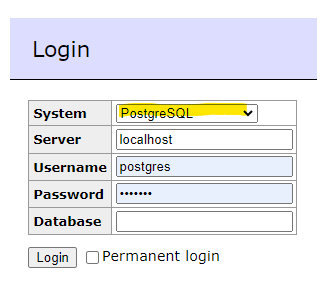

One of the most important aspect of this project is of course how we handle the automated testing, deployment and how we tackle Continuous Integration. This can be explained by showing how our pipeline and kubernetes cluster work.

# Pipeline
This is an automated script that is being run on every commit and can also be triggered manually. It comprises of several stages which are started, depending on the changes that have been commited and the target branch. The rule of thumb is: tests are being run on feature branches; tests, packaging and deployment happens on develop and release* branches.

Stages:
- update-db
  - deploys the database service
  - triggered by changes to the `ci/k8s/database.yaml` file on every branch
- update-ingress
  - deploys the kubernetes ingress configuration
  - triggered by changes to the `ci/k8s/ingress.yaml` file
- build-frontend
  - runs test and builds the frontend app
  - triggered by changes to the following (on every branch):
    - `frontend/*`
    - `ci/k8s/develop/frontend.yaml`
    - `ci/k8s/release/frontend.yaml`
    - `ci/containers/frontend.Dockerfile`
- package-frontend
  - takes the artifact from the previous stage (the transpiled frontend files) and packages them in a container
  - triggered by changes to the following (on branches develop and release*):
    - `frontend/*`
    - `ci/k8s/develop/frontend.yaml`
    - `ci/k8s/release/frontend.yaml`
    - `ci/containers/frontend.Dockerfile`
- test-backend
  - runs backend unittests
  - triggered by changes to the following (on every branch):
    - backend/*
- build-backend
  - packages the backend to a container
  - triggered by changes to the following (on branches develop and release*):
    - `backend/*`
    - `ci/k8s/develop/backend.yaml`
    - `ci/k8s/release/backend.yaml`
    - `ci/containers/backend.Dockerfile`  
- deploy
  - comprises of four substages: 
    - deploy-develop-frontend
      - deploys the frontent-develop k8s part
      - triggered by changes to the following (only on the develop branch):
        - `frontend/*`
        - `ci/k8s/develop/frontend.yaml`
        - `ci/containers/frontend.Dockerfile`
    - deploy-develop-backend
      - deploys the backend-develop k8s part
      - triggered by changes to the following (only on the develop branch):
        - `backend/*`
        - `ci/k8s/develop/backend.yaml`
        - `ci/containers/backend.Dockerfile`
    - deploy-release-frontend
      - deploys the frontend-release k8s part
      - triggered by changes to the following (only on the release* branches):
        - `frontend/*`
        - `ci/k8s/release/frontend.yaml`
        - `ci/containers/frontend.Dockerfile`
    - deploy-release-backend
      - deploys the backend-release k8s part
      - triggered by changes to the following (only on the release* branches):
        - `backend/*`
        - `ci/k8s/release/backend.yaml`
        - `ci/containers/backend.Dockerfile`

All the stages are triggered when the pipeline is run manually (packaging and deployment happens only on develop and release* branches).

# Kubernetes environment
Our kubernetes cluster is divided into 5 separate environments that contain a deployment and a service. The services are exposed to the internet through an ingress container. Please consider this high-level view:

## Develop
Contains two environments: 
- develop-frontend (runs a deployment with a backend-container deployed by the pipeline from the develop branch)
- develop-backend (runs a deployment with a frontend-container deployed by the pipeline from the develop branch)

## Release
Contains two environments: 
- release-frontend (runs a deployment with a backend-container deployed by the pipeline from a release* branch)
- release-backend (runs a deployment with a frontend-container deployed by the pipeline from a release* branch)

## Ingress
Controls the trafic-flow into the cluster.
Available endpoints:
- https://23ws-ase-pr-inso-06.apps.student.inso-w.at/db
- https://23ws-ase-pr-inso-06.apps.student.inso-w.at/develop/backend
- https://23ws-ase-pr-inso-06.apps.student.inso-w.at/develop/app
- https://23ws-ase-pr-inso-06.apps.student.inso-w.at/release/app
- https://23ws-ase-pr-inso-06.apps.student.inso-w.at/release/backend

The services from the backend environments communicate with the database through the database service (the traffic does not leave outside the cluster).

## Database
One environment with a deployment that hosts two containers:
- postgres (the database)
- adminer (the service that allows us to control the database on the web)

Logging into the db:

- set the db type to: postrgeSQL
- server: localhost
- username: **** (see our communication-channels for details)
- password: **** (see our communication-channels for details)