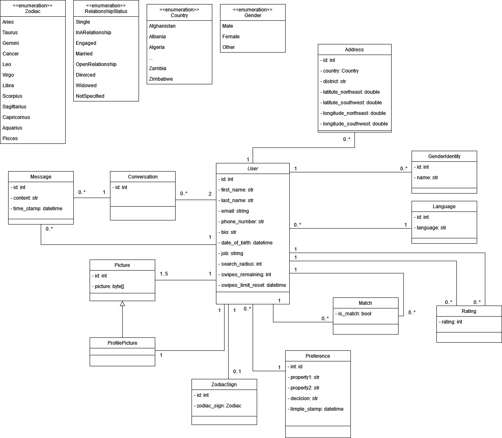
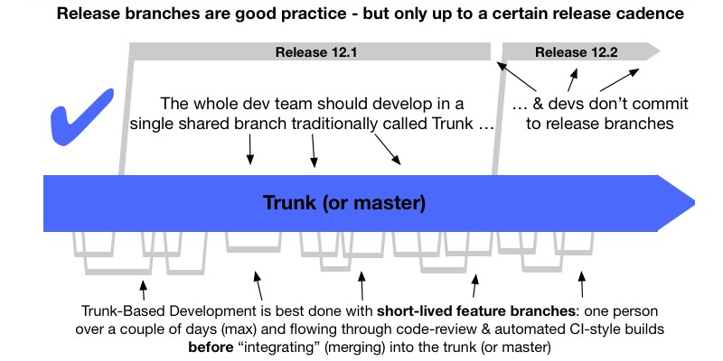

# ❤️ CustomLove ❤️
#### Project Contract 🖊️

## Table of contents 📖
* [Team Members](#team-members)
* [Initial situation and existing similar products](#initial-situation-and-existing-similar-products)
* [Project description](#project-description)
* [Target Audience](#target-audience)
* [Functional requirements](#functional-requirements)
* [Non-functional requirements](#non-functional-requirements)
* [Cost estimation](#cost-estimation)
* [Domain model](#domain-model)
* [Working structure and simple project plan](#working-structure-and-simple-project-plan)
* [Project boundaries](#project-boundaries)
* [Optional Requirements](#optional-requirements)
* [Supply components](#supply-components)
* [Legal environment](#legal-environment)
* [Risk assesment](#risk-assesment)
* [Information process](#information-process)

## Team members
The members of the team developing this project have been assigned the following roles and duties:
* **Team Coordinator** - _Christoph Wittauer_:
    * Evaluation and coordination of the project's progress
    * Communication with the client (i.e.: the tutor)
* **SCRUM Master** - _Anna Balla_:
    * Division of work into smaller parts (epics, sprints and stories)
    * Control over equal division of tasks between the team members
* **Test Coordinator** - _Moritz Schumacher_:
    * Decision over the set of tools used to perform testing and the extent to which the project is tested
    * Monitoring of the test-coverage
* **Documentation Lead** - _Tobias Gačko_:
    * Creation of rules regarding this project's documentation
    * Documenting the meetings and what has been established
* **Technical Architect** - _Bartosz Błachut_:
    * Establishing the technical stack and development rules
    * Testing and deployment automation.

## Initial situation and existing similar products

There are a lot of dating apps available on the market. To name a few: Bumble, Facebook Dating, Badoo, etc. Taking into account the research and personal experience of the team members, it has been established that the most popular one is Tinder.

Most of these applications offer a simple interface that allows the user to view some limited information about a person, see their uploaded pictures and, with this data in mind, decide whether the person in question would be a potential match. We will use many aspects of these well-proven UI designs to ensure easy-to-use handling. A few of the dating solutions on the market are also believed to have a matching algorithm that is supposed to find better-suited people based on the user’s previous choices. This is difficult to prove since the matching algorithms are not public. It's worth mentioning that all of the existing dating app companies are profit-oriented which certainly also plays a part in the algorithm design.

In many cases, this matching is very limited and mainly serves the purpose of making the user purchase one of the application’s subscriptions. It has been established, in the research, that the sheer action of “swiping” often leads to addictive disorders which are then being exploited by the companies. In general, there is a daily limit of “swipes” that a user can make. When one reaches one’s daily quota, one is being proposed with a paid subscription to get access to more people.

The creators of this project feel that it would be opportunistic to create an app that does not have a monetary agenda in its background. A daily swipe quota is believed to be necessary to avoid addictive behavior, however, there won’t be any paid subscriptions to broaden the daily limit. The human nature of the users won’t thus be exploited, and a user won’t be able to spend a whole day using this application.

This project also offers more than the aforementioned apps in terms of the positioning algorithm. The user will be able to choose between the three variants described in the previous section, instead of blindly believing a matching strategy without knowing how it actually works.

In contrast to other dating solutions, this project also focuses on fighting the superficiality of dating apps. The users should decide whether to match with a person first based on their BIO only. The pictures will be exchanged later in the chat. This is supposed to force users to actually write something in their profile descriptions instead of leaving them empty, as it often happens on e.g. Tinder. 

## Project description

We are developing a cutting-edge dating app that redefines the way people connect. Our platform leverages innovative features, including matching algorithms that the user can choose himself, advanced chat functionality, a user-friendly interface, to facilitate genuine and meaningful connections. Our goal is to provide a safe, transparent, and enjoyable dating experience for all users.

### Project Idea
**CustomLove** is an innovative dating application that seeks to redefine the way individuals connect with potential romantic partners. What sets **CustomLove** apart from conventional dating platforms is its distinctive features that empowers users to personalize their matchmaking experience by selecting from three unique matching algorithms:
* Distance-based
* Interest-based
* Decision-based
 
This approach enables users to finely tailor their matchmaking preferences, thereby augmenting the likelihood of forging meaningful connections. 

Introducing our new "Safety Rating" feature on our dating app! We understand that safety is a top priority when meeting new people, so we've implemented a unique system to help ease your mind. After you've met someone in person, you can now rate them as "Safe" within the app. This feature allows you to share your positive experiences and vouch for the reliability of the person you've met, creating a community-driven safety net. Feel more secure in your dating journey with our Safety Rating feature, promoting trust and transparency in every connection you make.

Furthermore, the app features a chat function that empowers users to engage in conversations, irrespective of their location, whether on a mobile device or through a web browser. **CustomLove** ensures users can effortlessly access and enjoy the app on their preferred platform.

### Domain
**CustomLove** operates within the realm of online dating and social networking, catering to individuals in pursuit of meaningful relationships and connections. It harnesses advanced technological solutions to optimize user experiences and relationships in the contemporary landscape of digital dating.

### Expected Improvements:
The developers aspire to tackle four prevalent challenges commonly associated with contemporary dating apps through the proposed application:
* **Transparency in Algorithm Selection:** **CustomLove** places control in the hands of users, allowing them to choose the rules by which matches are made. Users can opt for distance-based, preference-based, or quantity-maximizing algorithms, ensuring transparency and personalization.
* **Mitigating Superficiality:**
In response to concerns about superficiality, **CustomLove** does not initially reveal user images for swiping decisions. Images become viewable only during chat interactions, facilitating more genuine and meaningful connections. 
* **No Pricing Model:**
For us, dating is not about payment, so we do not implement a pricing model. Each user has a limited number of swipes, which cannot be influenced or increased through payments. Through this approach, we aim to maintain a low level of competitiveness in our dating app and prevent any manipulation through payments.
* **Addressing Addiction and Promoting Mental Health:** 
**CustomLove** combats the addictive nature of dating apps by restricting swiping. Users are allowed a limited number of swipes, thus fostering a healthier and more balanced usage pattern and reducing the negative impact on mental health.

### Problems/Challenges:
There are a multitude of things to consider while developing this dating app. Below, we have listed what we believe to be the most important points:

* **User Adoption and Competition:** The dating app market is highly competitive. Introducing a new app with innovative features is a great idea, but breaking into the market and gaining user adoption can be challenging. Existing platforms with large user bases may have a significant advantage.
* **Data Privacy and Security:** Dating apps handle sensitive personal data, which makes them attractive targets for hackers and cybercriminals. Ensuring robust data security measures to protect user information is vital, and any data breaches could lead to reputation damage and legal issues.
* **Algorithm Fairness and Bias:** Algorithms that consider various factors for matchmaking can inadvertently introduce biases or unfairness. Ensuring the fairness and transparency of these algorithms is essential to prevent discrimination or other ethical issues.
* **User Experience Challenges:** Users may find certain features, such as delayed image viewing, confusing or frustrating. Balancing user preferences for customization with a smooth and intuitive user experience can be a significant challenge.
* **Addiction and Mental Health Concerns:** While restricting swiping is intended to address addiction, it might not completely eliminate the risk. Users may still spend excessive time on the app, potentially impacting their mental health. Mitigating this risk and providing resources for responsible usage is important.
* **User Ratings and Misuse:** While the user rating feature can enhance transparency and trust, it also opens the door to potential misuse. Users may leave biased or unfair ratings, whether out of frustration, personal biases, or as a form of retaliation. Managing and moderating user ratings to prevent abuse and maintain the integrity of the feature can be a significant challenge. Unfair or malicious ratings can harm a user's reputation and experience, potentially leading to disputes and negative user interactions.
* **User Retention:** While customization options are attractive, maintaining user engagement and retention can be challenging. Users may become overwhelmed with options or disengaged over time.

### Architecture/Used Technologies:
In the development of our dating app, we will implement a well-established architecture that leverages the power of Flutter, FastAPI, and PostgreSQL. Flutter will serve as the frontend framework, enabling us to deliver **CustomLove** as both a web application and an Android app. FastAPI will take on the role of the REST Backend for our application, providing a robust framework for building the REST API, managing application logic, and handling data interactions. Meanwhile, PostgreSQL, a widely-adopted and scalable open-source relational database, will securely store user profiles, preferences, and chat histories. This shared architectural foundation guarantees stability and efficiency, allowing us to concentrate on delivering a seamless user experience while upholding crucial security measures. Summary:
* Programming Languages: Python, Dart, HTML, CSS, JavaScript
* Frameworks: Flutter, FastAPI
* Dependency Management: pip, pub (flutter package manager)
* Databases: PostgreSQL
* Versioning System: Git

## Target Audience

The **CustomLove** application is designed for individuals aged 18 and over who are seeking meaningful romantic relationships. The app will not employ any pricing models, ensuring accessibility for all users regardless of their financial situation. We are committed to fostering inclusivity, and every customer, irrespective of their gender or sexual orientation, is equally valued in terms of functionality and support within the application. 

## Iceberglist

We split our application **CustomLove** into five main features and provide the principal developer for each of them:

* **User Profile Management (Bartosz Błachut)**
  * Users define and create their own profiles using the frontend. Their data is stored in the database, with sensitive information like passwords being securely protected using a SHA hashing function and salt to guard against Rainbow Table attacks. User authentication is based on their login credentials, and authorization is granted through a bearer JWT token. There is no superuser with the ability to access other users account data.
* **Matching and Discovery (Moritz Schumacher)**
  * In Matching and Discovery, we're introducing three distinct modes to elevate your dating experience. To use them a user has to provide a radius in which the potential matches should stay.
  Firstly, the Distance-Based mode connects you randomly with people in proximity, making it easier to arrange in-person meetings and foster real-world connections.
  Secondly, our Interest-Based matching system helps you discover like-minded individuals who share your hobbies and passions, ensuring more meaningful and compatible matches.
  Lastly, with the Decision-Based approach, your matchmaking experience is spiced up by allowing a set number of previous swipes to influence your choices. It's a dynamic and engaging way to connect with potential matches.
  * All of the modes only allow matches within the given radius. Furthermore, the number of swipes is limited to 50 per day.
  These modes offer the user a more tailored and dynamic approach to find the ideal match, making the dating journey both enjoyable and efficient.
* **Communication (Anna Balla)**
  * Existing dating apps don’t provide a comfortable chat system yet - what makes users switch to other apps like Whatsapp to have better conversations - therefore our goal is to enhance user experience in that field. In our system the user can personalize his experience by sharing and sending pictures. Furthermore, the user receives real-time chat notifications, ensuring he never miss a moment of connection. The chat feature becomes only available if there's a mutual match between the two users, ensuring meaningful connections and conversations.
* **Safety Rating (Christoph Wittauer)** 
  * After meeting someone in person, you can now simply rate them as "Safe" within the app. This exclusive functionality allows you to express your confidence in the person you've met, fostering a community-driven approach to safety.
To maintain fairness and accuracy in our Safety Rating system, we're carefully considering the impact of each "Safe" rating. Our algorithm takes into account various factors to establish a balanced and reliable representation. By focusing solely on the "Safe" designation, we streamline the process, providing a quick and effective way for users to vouch for each other's trustworthiness.
This innovative feature aims to create a dating environment where users can confidently connect with others, knowing that their safety is a top priority. Join us in building a community that values transparency and mutual support, making your dating experience not only enjoyable but also secure.
* **Multi-Platform Accessibility (Tobias Gacko)**
  * As the application in question is a dating app and the current dating apps have found great success in themobile market, it is therefore important that our software will be available as a mobile application and downloadable from for example **Google Play** or the **App Store** by Apple. In addition, we also aim to provide a web app, so that we can reach as many potential users as possible.

## Functional requirements

In this section, we present a comprehensive list of functional requirements for **CustomLove**. For the list we switch to the user point of view to focus on use cases for future users.  In our approach, a user is an individual who created an account on **CustomLove** to discover and connect with potential matches.

* **User profile management**
  * As a user, I want to create an account.
  * As a user, I want to log in the application.
  * As a user, I want to log out of the application.
  * As a user, I want to delete my account
  * As a user, I am able to upload a maximum of 5 pictures.
  * As a user, I want to edit user features (firstname, lastname, email adress, phone number, bio, date of birth, job, profile pictures, gender identity, adresses, search radius, zodiac signs, spoken languages).
  * As a user I want to edit my interests.

* **Matching and discovery**
  * As a user I want to decide which maximum distance my potential matches have.
  * As a user I am able to swipe 50 times a day.
  * As a user, I want to choose the distance-based algorithm to find other users near my location.
  * As a user, I want to choose the interest-based algorithm to find other users with similar interests.
  * As a user, I want to choose the decision based strategy algorithm to find other users based on my previous swipes.
  * As a user, I want to weigh the three different matching algorithms differently.
  * As a user, I want to have a match with users who swiped each other right.
  * As a user I do not want to have a match with user I swiped left
  * As a user I do not want to see the profile pictures of other users during the swipe interaction.
  * As a user, I want to view profiles of users I've previously matched with.
  * As a user I want to be able to delete matches.

* **Communication**
  * As a user, I want to start a chat with my match.
  * As a user, I want to send pictures to my match.
  * As a user, I want to receive notifications when I get a new message.
  * As a user I want to see my complete chat history 
  * As a user I want to delete a chat and the corresponding match
  * As a user, I want to see when my messages have been read by other users.

* **Rating system**

  * As a user, I want to see if a other user has has the "Safe Button".
  * As a user, I want to see what it means that other user has the "Safe Button".
  * As a user, I can give a other user the "Safe Button" after meeting him.

* **Multi-Platform Accessibility**
  * As a user, I want to access the application on the web-browser.
  * As a user, I want to access the application on the smartphone.

## Non-functional requirements

* **Performance**
  * The app should be able to handle a concurrent user base of at least 1000 users without significant performance degradation.
  * Every response from the backend should not be slower than 2 seconds.
* **Reliability**
  * The application should be available for users 24/7, excluding maintenance windows for updates to the newest versions.
* **Security**
  * User data is protected against database leaks.
  * Protection against SQL injections.
  * Protection against JavaScript injections.
* **Usability**
  * The app uses market proven intuitive and user-friendly interface to ensure a positive user experience.
  * All main parts of the app should be accessible within one click
  * The user should be able to perform any action within 4 clicks.
  * The app can be used as mobile app as well as in the web browser.
  * Usability testing will be done with two real users, identifying and addressing issues.
    
    
## Cost estimation

* **Planning** (Total: 100 hours)
  * Define scope of work: 20 hours
  * Break down project into tasks: 40 hours
  * Estimate effort for each task: 40 hours
* **Development** (Total: 650 hours)
  * Build backend infrastructure: 100 hours
  * Build frontend interface: 150 hours
  * User profile management: 75 hours
  * Matching and discovery: 100 hours
  * Communication: 75 hours
  * Rating system: 75 hours
  * Multi-Platform accessibility: 75 hours
* **Testing** (Total: 250 hours)
  * Unit testing: 150 hours
  * Integration testing: 100 hours
* **Market release** (Total: 50 hours)
  * Market app: 50 hours

The total project effort estimation is 1000 hours for the next 15 weeks. To calculate the project costs, we assume an average salary of €40 per hour for each software engineer. Therefore, the total project cost is estimated to be €40,000.

## Domain model

## Working structure and simple project plan

### Distribution of roles

| Role                | Main               | Replacement        |
|---------------------|--------------------|--------------------|
| Technical Architect | Bartek Blachut     | Tobias Gacko       |
| Team Coordinator    | Christoph Wittauer | Moritz Schumacher  |
| Test Coordinator    | Moritz Schumacher  | Anna Balla         |
| Documentation       | Tobias Gacko       | Christoph Wittauer |
| SCRUM Master        | Anna Balla         | Bartek Blachut     |

### Horizontal responsibilities

It is expected of each team member to be aware and have a rough overview over the entire project. However, to be as efficient as possible, each team member, or a group of team members, will be assigned to implement a specific part of the project, e.g., a user story. 

The team will follow the _Trunk-based Model_, whereby team member(s) will work on a separate feature branch dedicated to a certain feature or user story, and merge ideally every day on the main branch, a.k.a. trunk (in our case, the branch is called "develop). The goal Trunk-Based Development is to enable Continuous Integration and by extension Continuous Delivery, as through daily commits and merges, the codebase is always releasable on demand and makes Continuous Delivery easily achievable.

### Simple Project Plan

#### Work Breakdown Structure (WBS)

The project management institute (PMI) defines WBS as the following: "A WBS is a hierarchical decomposition of the total scope of work to be carried out by the project team to accomplish the project objectives and create the required deliverables." \footnote{https://www.mpug.com/work-breakdown-structure-wbs-in-traditional-and-agile-life-cycles-with-ms-project/}

In reference to our project, our project will _decomposed_ be divided into separate features and user stories, and these in turn also if the scope and complexity asks for it. The individual features would be hierarchically split by priority, e.g., if one functionality within the app is dependant on others, then it is not sensible to begin working on it, before the required dependencies are implemented and available.

**Example:** The chat functionality between two users will require two users, meaning the object "User" will have to be implemented before the chat. The user in turn can be in turn decomposed into parts such as personal information, location, the ability to upload pictures etc.

#### Milestone Description

The Milestone builds the biggest block of the SCRUM development, as it describes a larger goal that is expected to be reached, before proceeding to the next step or stopping altogether. For our Dating App, the following milestones could be defined:
* Finalized backend
* Finalized web app layout and functionality
* Finalized mobile app layout and functionality
* Launch of the web and mobile app

## Project boundaries

In this section the developer want to illustrate the project boundaries. This will be done by providing demarcation criteria for each principal criteria:
* **User Profile Management**
  * As a user I can report a other user.
* **Matching and Discovery**
  * As a user I have insides on how the current proposed potential matches are selected.
  * As a user I can switch between the different matching algorithms more than once a day.
  * As a user I have more than 50 swipes per day.
* **Communication**
  * As a user, I can to see the online or last active status of my matches.
  * As a user, I can send and receive voice messages for a more personal touch in conversations.
  * As a user, I can link my Instagram or Spotify account to share content and interests with my matches.
  * As a user, I can send Videos.
  * As a user I’m protected from nudity and insult automatically from the app.
  * As a user, I can see when my messages have been read by other users.
* **Rating System**
  * As a user I can edit my earned "Safe Buttons".
  * As a user I can choose a matching algorithm which includes the Safety Rating.
* **Multi-Platform Accessibility**
  * As a user I can use the mobile-app on a different operating system than android.
    

## Optional Requirements:
In addition to the essential functional, non-functional, and demarcation criteria, the developer also wishes to establish a set of optional criteria for the app. These optional criteria will be accorded a high priority if all the preceding criteria are successfully implemented and there is available time to address them.
* The set of profiles that are used to make decisions in the decision-based matching is artificial, to enable a better performance of the expert system.
* The location determination of users is dynamically and automatically. So the user doesn't have to type in or update his location manually. 
* A user can report another user when he for example acts wrong.
* Extending the chat with advanced features like searching for messages or responding to specific messages.

## Supply Components

The developers of this project have planned to deliver the following components:
* **Software:**
  * Application frontend that is written in a cross-platform framework (_Flutter_) that allows to share the code base between the mobile version of the application for _Android_ and _IOS_ and the web-based version;
  * Application backend written in _FastAPI_
  * Unit test suite for both frontend and backend parts
  * Integration and end-to-end testing suite
  * A container suite used to integrate and package the application
* **Artifacts:**
  * Packaged applications
  * Database design diagram
  * UML domain model
  * Application pitch
* **Documentation:**
  * Project documentation
  * Development documentation (how to contribute)
    

## Legal environment

The dating application will be an open source and freely available application, that unlike established apps such as Tinder does not aim to exploit addictions, but instead would provide a limited amount of possible swipes.

In terms of the legal environment such as law and regulations, there are multiple perspectives needing to be considered, such as which laws apply based on the country or the region.

* Data privacy and security:
  * General Data Protection Regulation (GDPR) in Europe.
  * Other data protection laws and regulations in different regions.
* Age restrictions:
  * Users using the app are of legal age, meaning over 18.
* Terms of Service and User Agreements:
  * Clearly defined terms of use and privacy policies.
  * Consent and agreement to these terms by users.
* Intellectual Property:
  * Intellectual property laws for content, images, and trademarks.
  * Ensuring user-generated content does not infringe on others' copyrights or trademarks.
* Online Harassment and Cyberbullying:
  * Measures to prevent harassment, stalking, or abuse on the platform.
  * Compliance with anti-harassment laws and regulations.
* Discrimination and Equal Opportunity:
  * Avoiding discrimination based on race, religion, gender, sexual orientation, or other protected characteristics.
  * Compliance with anti-discrimination laws and regulations.
* Safety and Reporting Features:
  * Implementing safety measures and tools for users to report abuse or safety concerns.
* Content Moderation:
  * Policies and procedures for content moderation to remove inappropriate or illegal content.
  * Compliance with content moderation regulations.
    

## Risk Assesement

In the context of dating apps, there is are numerous potential dangers and risks that needed one needs to be aware of. Some of the most important topics in this area include for example safety, privacy, and security.

### General Risks
    
* **Technical Risk**
  * Description: the system may experience crashes or SW bugs 
  * Probability of occurrence: depends on complexity of the technology stack and the quality of project planning
  * Impact on the project: poor user experience, tendency that user will abandon the app
  * Countermeasures: code reviews on a regular basis, prepare for technical failures with contingency plans, isolate SW modules, backup components
* **Market Competition Risk**
  * Description: there are many competitive dating apps on the market, e.g. Tinder
  * Probability of occurrence: high
  * Impact on the project: non-economical
  * Countermeasures: enhance user experience, develop unique features, no pricing model
* **Human Resource Risk**
  * Description: a team member may leave the team
  * Probability of occurrence: can be anytime, depends on the fact if the team members feel at ease within the team
  * Impact on the project: project delays, increased workload for each team member
  * Countermeasures: strong team communication and collaboration, having stand-ins, balanced workload
* **Project Delivery Timing Risk**
  * Description: risk of missing the project deadline
  * Probability of occurrence: if there is a lack in communication, motivation or/and in programming skills, then high
  * Impact on the project: financial and quality loss, competitive disadvantage, team frustration
  * Countermeasures: create realistic project timeline, using agile methodology SCRUM, prioritize the advanced features (must be delivered on time)
    
    

### Project-Specific Risks
    
* **Scalability Risk**
  * Description: the more the app gains on popularity the more it is necessary that the system is able to scale effectively in order to meet the expectations of the growing user base $\rightarrow$ handle increasing workload
  * Probability of occurrence: depends on the design and architecture of the system, but increases with growing user numbers
  * Impact on the project: downtime of the system $\rightarrow$ user frustration, hard to fix/extend system under pressure, performance issues
  * Countermeasures: the infrastructure, database, code should be optimized for potential growth, load tests
* **Third-party Dependency Risk**
  * Description: risk that third-party service on which our system relies on is not always available, not reliable or APIs are updated 
  * Probability of occurrence: rather low
  * Impact on the project: service disruption, performance/compatibility issues
  * Countermeasures: establish SLAs (Service Level Agreements) which define the expected level of service and penalties in case of downtime, dependency tracking, backup systems
* **Matching Algorithm Efficiency Risk**
  * Description: algorithm may fail providing quality matches
  * Probability of occurrence: moderate
  * Impact on the project: user dissatisfaction, loss of users
  * Countermeasures: continuous improvement of algorithm, user feedback analysis
* **Fake Profile Risk**
  * Description: user may create a fake profile
  * Probability of occurrence: low to moderate
  * Impact on the project: user dissatisfaction
  * Countermeasures: possibility to report fake accounts, verification methods [optional]
* **Security Risk** 
  * Description: app handles sensitive data (personal info, location data) $\rightarrow$ risk of unauthorized access
  * Probability of occurrence: high because the app is an attractive target for cyberattacks
  * Impact on the project: legal consequences, financial costs, loss of user trust, damaged reputation 
  * Countermeasures: ensure compliance with data protection regulations, penetration testing, data encryption
    
    
## Information process

The information flow involves several key steps and components, including:
* Adherence to the established SCRUM methodology - two weekly meetings that serve a purpose of:
    * Review of the work that has already been done;
    * Establishing new goals;
    * Assigning new tasks or the not-completed issues;
    * Determining if the team is on-track to fulfill the established final goals;
* Adherence to the established source-code-management rules:
    * Following the branch-naming scheme;
    * Following the commit-message scheme;
    * Merging only with the required number of reviews;
* Correct usage of the adopted tools:
    * Discord - main communication channel;
    * Teams - live-meetings;
    * Overleaf - writing reports;
    * Office365 Suite - creating pitches and presentations.
    

The members of the development team adhere to the aforementioned rules and use the selected tools for their established purposes. That way the team is able to work transparently and communicate without misunderstandings.
