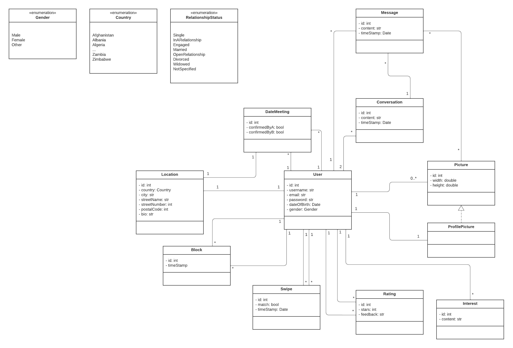

# CustomLove
#### Next level dating for everyone

##### 188.910: Advanced Software Engineering

#### Group: newbies
| Name               | Matriculation number | Mail                           | Role                      |
|--------------------|----------------------|--------------------------------|---------------------------|
| Christoph Wittauer | 11723544             | e11723544@student.tuwien.ac.at | Team Coordinator          |
| Tobias Gacko       | 11730105             | e11730105@student.tuwien.ac.at | Documentation Coordinator |
| Moritz Schumacher  | 12331473             | e12331473@tuwien.ac.at         | Test Coordinator          |
| Bartosz Blachut    | 12249629             | e12249629@tuwien.ac.at         | Technical Architect       |
| Anna Balla         | 11709469             | e11709469@tuwien.ac.at         | Scrum Master              |

## Team Members
The members of the team developing this project have been assigned the following roles and duties:
* **Team Coordinator** - _Christoph Wittauer_
  * Evaluation and coordination of the project's progress
  * Communication with the client (i.e.: the tutor)
* **SCRUM Master** - _Anna Balla_
  * Division of work into smaller parts (epics, sprints and stories)
  * Control over equal division of tasks between the team members
* **Test Coordinator** - _Moritz Schumacher_
  * Decision over the set of tools used to perform testing and the extent to which the project is tested
  * Monitoring of the test-coverage
* **Documentation Lead** - _Tobias Gacko_
  * Creation of rules regarding this project's documentation
  * Documenting the meetings and what has been established
* **Technical Architect** - _Bartosz Blachut_
  * Establishing the technical stack and development rules
  * Testing and deployment automation

## Project description
We are developing a cutting-edge dating app that redefines the way people connect. Our platform leverages innovative features, including matching algorithms that the user can choose himself, advanced chat functionality, a rating system for other users and a user-friendly interface, to facilitate genuine and meaningful connections. Our goal is to provide a safe, transparent, and enjoyable dating experience for all users.

### Project Idea
CustomLove is an innovative dating application that seeks to redefine the way individuals connect with potential romantic partners. What sets **CustomLove** apart from conventional dating platforms is its distinctive feature that empowers users to personalize their matchmaking experience by selecting from three unique matching algorithms:
* Distance-based
* Interest-based
* Quantity-driven (maximize matches)

This approach enables users to finely tailor their matchmaking preferences, thereby augmenting the likelihood of forging meaningful connections. 

What further sets **CustomLove** apart is its unique feature that allows users to rate other users. This feature enables individuals to provide feedback and ratings on their dating experiences, contributing to a more transparent and trustworthy community. Users can express their satisfaction with a match, share their insights, and help others make more informed decisions when choosing potential partners. This rating system promotes accountability and ensures that users can engage with others in a safer and more reliable dating environment.

Furthermore, the app includes a chat function that allows users to chat with each other. Importing a private calendar is also possible to facilitate more efficient scheduling for potential dates will also be possible.

### Domain
**CustomLove** operates within the realm of online dating and social networking, catering to individuals in pursuit of meaningful relationships and connections. It harnesses advanced technological solutions to optimize user experiences and relationships in the contemporary landscape of digital dating.

### Expected Improvements
The developers aspire to tackle four prevalent challenges commonly associated with contemporary dating apps through the proposed application:
* **Transparency in Algorithm Selection:** **CustomLove** places control in the hands of users, allowing them to choose the rules by which matches are made. Users can opt for distance-based, preference-based, or quantity-maximizing algorithms, ensuring transparency and personalization.
* **Mitigating Superficiality:** In response to concerns about superficiality, **CustomLove** does not initially reveal user images for swiping decisions. Images become viewable only during chat interactions, facilitating more genuine and meaningful connections. 
* **No Pricing Model:** For us, dating is not about payment, so we do not implement a pricing model. Each user has a limited number of swipes, which cannot be influenced or increased through payments. Through this approach, we aim to maintain a low level of competitiveness in our dating app and prevent any manipulation through payments.
* **Addressing Addiction and Promoting Mental Health:** **CustomLove** combats the addictive nature of dating apps by restricting swiping. Users are allowed a limited number of swipes, thus fostering a healthier and more balanced usage pattern and reducing the negative impact on mental health.

### Problems/Challenges
There are a multitude of things to consider while developing this dating app. Below, we have listed what we believe to be the most important points:
1. **User Adoption and Competition:** The dating app market is highly competitive. Introducing a new app with innovative features is a great idea, but breaking into the market and gaining user adoption can be challenging. Existing platforms with large user bases may have a significant advantage.
2. **Data Privacy and Security:** Dating apps handle sensitive personal data, which makes them attractive targets for hackers and cybercriminals. Ensuring robust data security measures to protect user information is vital, and any data breaches could lead to reputation damage and legal issues.
3. **Algorithm Fairness and Bias:** Algorithms that consider various factors for matchmaking can inadvertently introduce biases or unfairness. Ensuring the fairness and transparency of these algorithms is essential to prevent discrimination or other ethical issues.
4. **User Experience Challenges:** Users may find certain features, such as delayed image viewing, confusing or frustrating. Balancing user preferences for customization with a smooth and intuitive user experience can be a significant challenge.
5. **Addiction and Mental Health Concerns:** While restricting swiping is intended to address addiction, it might not completely eliminate the risk. Users may still spend excessive time on the app, potentially impacting their mental health. Mitigating this risk and providing resources for responsible usage is important.
6. **User Ratings and Misuse:** While the user rating feature can enhance transparency and trust, it also opens the door to potential misuse. Users may leave biased or unfair ratings, whether out of frustration, personal biases, or as a form of retaliation. Managing and moderating user ratings to prevent abuse and maintain the integrity of the feature can be a significant challenge. Unfair or malicious ratings can harm a user's reputation and experience, potentially leading to disputes and negative user interactions.
7. **User Retention:** While customization options are attractive, maintaining user engagement and retention can be challenging. Users may become overwhelmed with options or disengaged over time.

### Architecture/Used Technologies:
In developing our web-based dating app, we will adopt a widely used architecture that combines Django and MariaDB. Django will serve as the backbone of our application, offering a robust framework for building the user interface, handling application logic, and managing data interactions. MariaDB, a popular and scalable open-source relational database, will securely store user profiles, preferences, and chat histories. This common architecture ensures a stable and efficient foundation, allowing us to focus on delivering a seamless user experience while maintaining essential security measures. Summary:
* Programming Languages: Python, HTML, CSS, JavaScript
* Frameworks: Django
* Dependency Management: pip
* Databases: MariaDB
* Versioning System: Git

### Domain Model

## Related work
There are a lot of similar solutions available on the market. To name a few: Bumble, Facebook Dating, Badoo, etc. Taking into account the research and personal experience of the team members, it has been established that the most popular one is Tinder.

Most of these applications offer a simple interface which allows the user to view some limited information about a person, see their uploaded pictures and, with this data in mind, decide whether the person in question would be a potential match. A few of the dating solutions on the market are also believed to have a matching algorithm that is supposed to find better suited people based on the user’s previous choices. 

In many cases, this matching is very limited and mainly serves a purpose of making the user purchase one of the application’s subscriptions. It has been established, in the research, that the sheer action of “swiping” often leads to addictive disorders which are then being exploited by the companies. In general, there is a daily limit of “swipes” that a user can make. When one reaches one’s daily quota, one is being proposed with a paid subscription to get access to more people.

The creators of this project feel that it would be opportunistic to create an app which does not have a monetary agenda in its background. A daily swipe-quota is believed to be necessary to avoid addictive behavior, however there won’t be any paid subscriptions to broaden the daily limit. The human nature of the users won’t thus be exploited, and a user won’t be able to spend a whole day on using this application.

This project also offers more than the aforementioned apps in terms of the positioning algorithm. The user will be able to choose between three variants described in the previous section, instead of blindly believing a matching strategy without knowing how it actually works.

In contrast to other dating solutions, this project also focuses on fighting with the superficiality of the dating apps. The users should decide whether to match with a person first based on their BIO only. The pictures will be exchanged later in the chat. This is supposed to force users to actually write something in their profile descriptions instead of leaving them empty, as it often happens on e.g. Tinder. 

## Stakeholders
In view of the fact that this project is not managed by a company, there can't be many stakeholders apart from the team members described in detail in section _Team Members_. However, it would be reasonable to mention the focus group, i.e. the customers this project targets. 

This application is meant to reach people over 18 who are trying to find a romantic relationship. No pricing models will be offered, therefore the financial situation of the targeted group is of no matter. Furthermore, every customer is to be equally considered (in terms of functionality), regardless of their gender or sexual orientation. 

## Legal Environment
The dating application will be an open source and freely available application, that unlike established apps such as Tinder does not aim to exploit addictions, but instead would provide a limited amount of possible swipes.

In terms of the legal environment such as law and regulations, there are multiple perspectives needing to be considered, such as which laws apply based on the country or the region.

1. Data privacy and security:
  * General Data Protection Regulation (GDPR) in Europe.
  * Other data protection laws and regulations in different regions.
2. Age restrictions:
  * Users using the app are of legal age, meaning over 18.
3. Terms of Service and User Agreements:
  * Clearly defined terms of use and privacy policies.
  * Consent and agreement to these terms by users.
4. Intellectual Property:
  * Intellectual property laws for content, images, and trademarks.
  * Ensuring user-generated content does not infringe on others' copyrights or trademarks.
5. Online Harassment and Cyberbullying:
  * Measures to prevent harassment, stalking, or abuse on the platform.
  * Compliance with anti-harassment laws and regulations.
6. Discrimination and Equal Opportunity:
  * Avoiding discrimination based on race, religion, gender, sexual orientation, or other protected characteristics.
  * Compliance with anti-discrimination laws and regulations.
7. Safety and Reporting Features:
  * Implementing safety measures and tools for users to report abuse or safety concerns.
8. Content Moderation:
  * Policies and procedures for content moderation to remove inappropriate or illegal content.
  * Compliance with content moderation regulations.

## Cost estimation
For the cost estimation, we break down the project into four phases following the principles of SCRUM:
1. Planning (1 week)
  * Define scope of work
  * Break down project into tasks
  * Estimate effort for each task
2. Development (10 weeks)
  * Build backend infrastructure
  * Build frontend interface
  * Implement features
3. Testing (2 weeks)
  * Unit testing
  * Integration testing
4. Market release (1 week)
  * Market app

### Effort Estimation for Each Phase
1. **Planning** (Total: 100 hours)
  * Define scope of work: 20 hours
  * Break down project into tasks: 40 hours
  * Estimate effort for each task: 40 hours
2. **Development** (Total: 650 hours)
  * Build backend infrastructure: 85 hours
  * Build frontend interface: 85 hours
  * Feature 1 chat system: 100 hours
  * Feature 2 automatic scheduling and date suggestions: 100 hours
  * Feature 3 social rating system: 100 hours
  * Feature 4 matching algorithms: 180 hours
3. **Testing** (Total: 250 hours)
  * Unit testing: 150 hours
  * Integration testing: 100 hours
4. **Market release** (Total: 50 hours)
  * Market app: 50 hours

The total project effort estimation is 1000 hours for the next 15 weeks. To calculate the project costs, we assume an average salary of €40 per hour for each software engineer. Therefore, the total project cost is estimated to be €40,000.

## Risks
1. **Human Resource Risk**
  * Description: a team member may leave the team
  * Probability of occurrence: can be anytime, depends on the fact if the team members feel at ease within the team
  * Impact on the project: project delays, increased workload for each team member
  * Countermeasures: strong team communication and collaboration, having stand-ins, balanced workload
2. **Project Delivery Timing Risk**
  * Description: risk of missing the project deadline
  * Probability of occurrence: if there is a lack in communication, motivation or/and in programming skills, then high
  * Impact on the project: financial and quality loss, competitive disadvantage, team frustration
  * Countermeasures: create realistic project timeline, using agile methodology SCRUM, prioritize the advanced features (must be delivered on time)
3. **Technical Risk**
  * Description: the system may experience crashes or SW bugs 
  * Probability of occurrence: depends on complexity of the technology stack and the quality of project planning
  * Impact on the project: poor user experience, tendency that user will abandon the app
  * Countermeasures: code reviews on a regular basis, prepare for technical failures with contingency plans, isolate SW modules, backup components
4. **Scalability Risk**
  * Description: the more the app gains on popularity the more it is necessary that the system is able to scale effectively in order to meet the expectations of the growing user base $\rightarrow$ handle increasing workload
  * Probability of occurrence: depends on the design and architecture of the system, but increases with growing user numbers
  * Impact on the project: downtime of the system $\rightarrow$ user frustration, hard to fix/extend system under pressure, performance issues
  * Countermeasures: the infrastructure, database, code should be optimized for potential growth, load tests
5. **Third-party Dependency Risk**
  * Description: risk that third-party service on which our system relies on is not always available, not reliable or APIs are updated 
  * Probability of occurrence: rather low
  * Impact on the project: service disruption, performance/compatibility issues
  * Countermeasures: establish SLAs (Service Level Agreements) which define the expected level of service and penalties in case of downtime, dependency tracking, backup systems
6. **Compliance and Legal Risk**
  * Description: app handles sensitive data (personal info, location data) $\rightarrow$ risk of unauthorized access
  * Probability of occurrence: high because the app is an attractive target for cyberattacks
  * Impact on the project: legal consequences, financial costs, loss of user trust, damaged reputation 
  * Countermeasures: ensure compliance with data protection regulations, penetration testing, data encryption